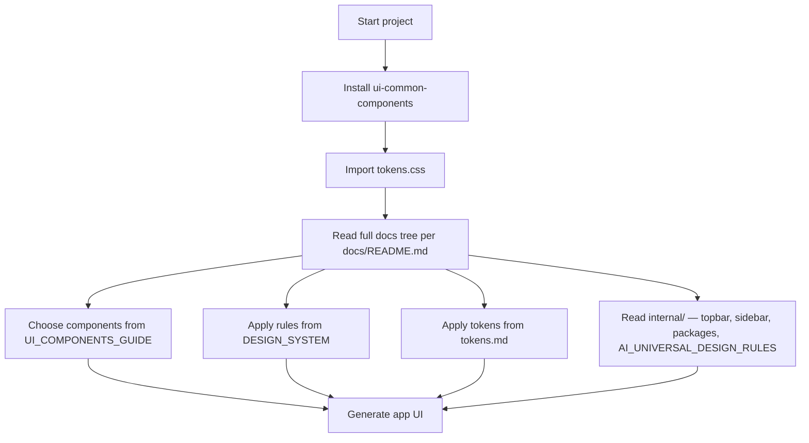

# AI usage guide

Use this file when you want an AI tool to build a real application with `ui-common-components`.

**Read all Markdown under `docs/`** (see [`README.md`](./README.md) for the numbered list and flow diagram). Internal docs are required, not skipped.

## Read in this order

1. [`../README.md`](../README.md) — installation and setup
2. [`README.md`](./README.md) — full `docs/` reading order + diagram
3. [`AGENTS.md`](./AGENTS.md) — AI memory and export notes
4. [`UI_COMPONENTS_GUIDE.md`](./UI_COMPONENTS_GUIDE.md)
5. [`design-system/README.md`](./design-system/README.md)
6. [`design-system/DESIGN_SYSTEM.md`](./design-system/DESIGN_SYSTEM.md)
7. [`design-system/tokens.md`](./design-system/tokens.md)
8. [`internal/README.md`](./internal/README.md)
9. [`internal/DOC_INDEX.md`](./internal/DOC_INDEX.md)
10. [`internal/APP_TOPBAR_SYSTEM.md`](./internal/APP_TOPBAR_SYSTEM.md)
11. [`internal/SIDEBAR_NAVIGATION_SYSTEM.md`](./internal/SIDEBAR_NAVIGATION_SYSTEM.md)
12. [`internal/PACKAGES.md`](./internal/PACKAGES.md)
13. [`internal/AI_UNIVERSAL_DESIGN_RULES.md`](./internal/AI_UNIVERSAL_DESIGN_RULES.md)
14. [`AI_USAGE_GUIDE.md`](./AI_USAGE_GUIDE.md) — this file (rules consolidation)

## What AI should use each file for

- [`UI_COMPONENTS_GUIDE.md`](./UI_COMPONENTS_GUIDE.md): choose the right component
- [`design-system/DESIGN_SYSTEM.md`](./design-system/DESIGN_SYSTEM.md): apply layout, spacing, hierarchy, card, modal, and accessibility rules
- [`design-system/tokens.md`](./design-system/tokens.md): apply token-based styling and token import rules
- [`internal/`](./internal/): shell implementation context, package rationale, portable rules — use with the public guides above

## Required rules

Always:

- use `ui-common-components` before creating custom UI
- prefer subpath imports when a route or feature only needs charts, shell, or table: `ui-common-components/charts`, `ui-common-components/shell`, `ui-common-components/table` (smaller bundles than the main entry)
- import `ui-common-components/design-system/tokens.css` once at app root
- for dashboard-style apps (sidebar + top bar + main content), use **`DashboardShell`** with **`AppSidebar`** and **`AppTopbar`** — do not use the name **`AppShell`** in new code (it is only a legacy alias)
- for card UIs with distinct header, body, and footer, prefer **`Card`** compound parts (`CardHeader`, `CardTitle`, `CardDescription`, `CardAction`, `CardContent`, `CardFooter`) per **`UI_COMPONENTS_GUIDE.md`**
- use tokens instead of hardcoded colors, spacing, radius, or shadows
- keep one primary CTA per screen
- keep inputs and actions in separate rows
- preserve accessibility and visible focus states

Never:

- use Bootstrap with this library
- create multiple equal-weight primary CTAs
- hardcode values when tokens already exist
- ignore the design system to create one-off visual patterns

## AI workflow

## Copy-paste AI instruction

Use `ui-common-components` and follow the UX Governance design system.

Read **all** files under `docs/` in the order listed in `docs/README.md` (including `docs/internal/`).

Rules:

- use library components before building custom UI
- for shell-only or chart-only or table-only screens, import from `ui-common-components/shell`, `/charts`, or `/table` instead of the main package entry when possible
- for shell layouts, use `DashboardShell` (not `AppShell`) with `AppSidebar` and `AppTopbar` per `UI_COMPONENTS_GUIDE.md`
- for structured cards, use `Card` with `CardHeader`, `CardTitle`, `CardContent`, `CardFooter` (and related exports) when appropriate
- use tokens instead of hardcoded values
- keep inputs and actions in separate rows
- keep one primary CTA per screen
- preserve accessibility and focus states

## Success criteria

A correct result should:

- use shared library components
- follow the design system
- use token-based styling
- look consistent with the rest of the system
- respect notes in `docs/internal/` when implementing shell or library-adjacent behavior
