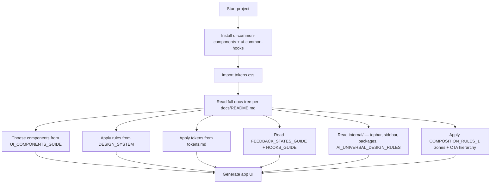

# AI usage guide

Use this file when you want an AI tool to build a real application with `ui-common-components` and `ui-common-hooks`.

**Read all Markdown under `docs/`** (see [`README.md`](./README.md) for the numbered list and flow diagram). Internal docs are required, not skipped.

---

## Read in this order

1. [`../AGENTS.md`](../AGENTS.md) — **start here** (root AI entry point)
2. [`README.md`](./README.md) — full `docs/` reading order + diagram
3. [`AGENTS.md`](./AGENTS.md) — AI memory and export notes
4. [`UI_COMPONENTS_GUIDE.md`](./UI_COMPONENTS_GUIDE.md)
5. [`FEEDBACK_STATES_GUIDE.md`](./FEEDBACK_STATES_GUIDE.md) — FeedbackStates + animations
6. [`HOOKS_GUIDE.md`](./HOOKS_GUIDE.md) — ui-common-hooks
7. [`design-system/README.md`](./design-system/README.md)
8. [`design-system/DESIGN_SYSTEM.md`](./design-system/DESIGN_SYSTEM.md)
9. [`design-system/tokens.md`](./design-system/tokens.md)
10. [`internal/README.md`](./internal/README.md)
11. [`internal/DOC_INDEX.md`](./internal/DOC_INDEX.md)
12. [`internal/APP_TOPBAR_SYSTEM.md`](./internal/APP_TOPBAR_SYSTEM.md)
13. [`internal/SIDEBAR_NAVIGATION_SYSTEM.md`](./internal/SIDEBAR_NAVIGATION_SYSTEM.md)
14. [`internal/PACKAGES.md`](./internal/PACKAGES.md)
15. [`internal/AI_UNIVERSAL_DESIGN_RULES.md`](./internal/AI_UNIVERSAL_DESIGN_RULES.md)
16. [`COMPOSITION_RULES_1.md`](./COMPOSITION_RULES_1.md) — zones + CTA hierarchy (FRD examples)
17. [`design-system/DESIGN_SYSTEM_TOKENS_REFERENCE.md`](./design-system/DESIGN_SYSTEM_TOKENS_REFERENCE.md) — token tables
18. [`design-system/THEMES.md`](./design-system/THEMES.md) — themes + QA
19. [`design-system/COMPONENT_AUDIT.md`](./design-system/COMPONENT_AUDIT.md) — production checklist

---

## What AI should use each file for

| File | Purpose |
|------|---------|
| [`UI_COMPONENTS_GUIDE.md`](./UI_COMPONENTS_GUIDE.md) | Choose the right component |
| [`FEEDBACK_STATES_GUIDE.md`](./FEEDBACK_STATES_GUIDE.md) | Build empty, error, offline, and success states |
| [`HOOKS_GUIDE.md`](./HOOKS_GUIDE.md) | Choose and use the right hook |
| [`design-system/DESIGN_SYSTEM.md`](./design-system/DESIGN_SYSTEM.md) | Apply layout, spacing, hierarchy, accessibility |
| [`design-system/tokens.md`](./design-system/tokens.md) | Apply token-based styling |
| [`COMPOSITION_RULES_1.md`](./COMPOSITION_RULES_1.md) | Zone layout (FRD examples), CTA hierarchy, information density |
| [`design-system/DESIGN_SYSTEM.md`](./design-system/DESIGN_SYSTEM.md) | **§22a** canonical zone diagram |
| [`internal/`](./internal/) | Shell implementation, package rationale, portable rules |

---

## Required rules

### Always

- Use `ui-common-components` before creating custom UI
- Use `ui-common-hooks` before creating custom hooks
- Import `ui-common-components/design-system/tokens.css` once at app root
- For dashboard-style apps, use `DashboardShell` with `AppSidebar` and `AppTopbar`
- For card UIs, prefer `Card` compound parts (`CardHeader`, `CardTitle`, `CardContent`, `CardFooter`)
- Use tokens instead of hardcoded colors, spacing, radius, or shadows
- Define the 5 visual zones before writing any new screen (see **DESIGN_SYSTEM §22a** + `COMPOSITION_RULES_1.md`)
- Keep one primary CTA per zone (never two competing `variant="primary"` buttons)
- Use `EmptyState` / `ErrorState` / `OfflineBanner` for feedback — not custom one-offs
- Pair feedback state components with `useAsyncContentPhase` from `ui-common-hooks`
- Subpath imports when a route only needs one area: `/charts`, `/shell`, `/table`
- Prefer `useDebounce` or `useDebouncedCallback` for search inputs over inline `setTimeout`
- Use `useClientTableState` for table search + sort + pagination
- Use `useOnlineStatus` + `useAsyncContentPhase` for offline detection

### Never

- Use Bootstrap with this library
- Create multiple equal-weight primary CTAs on the same screen
- Hardcode values when tokens already exist
- Create custom empty/error/offline UI when `FeedbackState` / `EmptyState` / `ErrorState` exist
- Use `dangerouslySetInnerHTML`
- Use `AppShell` in new code (legacy alias — use `DashboardShell`)
- Skip `docs/internal/` — it is required

---

## Screen authoring checklist

Before writing a new screen:

1. **Install** `ui-common-components` and `ui-common-hooks`
2. **Import** `tokens.css` at app root
3. **Define zones** (COMPOSITION_RULES_1 — 5 visual zones)
4. **Pick components** from `UI_COMPONENTS_GUIDE.md` for each zone
5. **Pick hooks** — use `useAsyncContentPhase` if the screen fetches data
6. **Add FeedbackStates** — EmptyState / ErrorState / OfflineBanner for Zone 4 fallbacks
7. **Check CTA hierarchy** — one `primary` per zone, `ghost` for secondary
8. **Check a11y** — focus states, aria attributes, touch targets

---

## AI workflow


```mermaid
flowchart TD
    A[Start project] --> B[Install ui-common-components + ui-common-hooks]
    B --> C[Import tokens.css]
    C --> D[Read full docs tree per docs/README.md]
    D --> E[Choose components from UI_COMPONENTS_GUIDE]
    D --> F[Apply rules from DESIGN_SYSTEM]
    D --> G[Apply tokens from tokens.md]
    D --> H[Read FEEDBACK_STATES_GUIDE + HOOKS_GUIDE]
    D --> I[Read internal/ — topbar, sidebar, packages, AI_UNIVERSAL_DESIGN_RULES]
    D --> J[Apply COMPOSITION_RULES_1 zones + CTA hierarchy]
    E --> K[Generate app UI]
    F --> K
    G --> K
    H --> K
    I --> K
    J --> K
```

---

## Copy-paste AI instruction block

Paste this into any AI tool before asking it to generate code from this repo:

```
Use `ui-common-components` (v0.0.2) and `ui-common-hooks` (v0.3.0).
Follow the UX Governance design system.

Read ALL files under `docs/` in the order in `docs/README.md` (including `docs/internal/`).
Also read `AGENTS.md` (root), `docs/COMPOSITION_RULES_1.md`, `design-system/DESIGN_SYSTEM.md` §22a.

Rules:
- Use library components + hooks before building custom ones
- Import `ui-common-components/design-system/tokens.css` once at app root
- For shell layouts: DashboardShell (not AppShell) + AppSidebar + AppTopbar
- For cards: Card with CardHeader/CardTitle/CardContent/CardFooter
- For feedback states: EmptyState, ErrorState, OfflineBanner, FeedbackState
- Pair FeedbackState with useAsyncContentPhase from ui-common-hooks
- Define 5 visual zones (COMPOSITION_RULES_1) before writing any screen
- One primary CTA per zone; ghost for secondary actions
- Use tokens instead of hardcoded values
- Keep inputs and actions in separate rows
- Preserve accessibility and WCAG 2.2 AA focus states
- Avatar = Avtar, Tooltip = ToolTip, Input (not TextInput)
```

---

## Success criteria

A correct result should:

- Use shared library components and hooks
- Follow the design system tokens and visual hierarchy
- Show FeedbackState / EmptyState / ErrorState where appropriate
- Use `useAsyncContentPhase` to drive loading → empty → error → ready transitions
- Apply the 5 visual zones correctly per `COMPOSITION_RULES_1.md`
- Have one primary CTA per zone
- Look consistent with the rest of the system
- Be accessible (WCAG 2.2 AA minimum)
