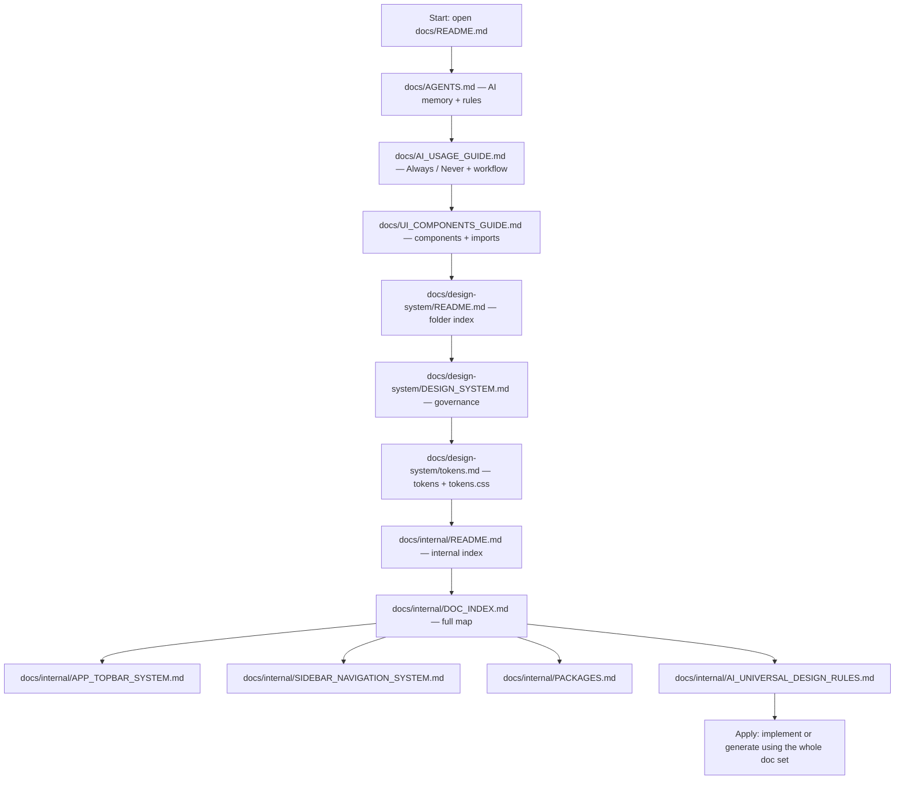

# Documentation

**Developers and AI agents must read every Markdown file under `docs/`** (including `docs/internal/` and `docs/design-system/`). No subsection is optional: public guides and internal notes work together as one system.

Latest shared package bundle: `ui-common-components-0.0.1.tgz`

## Documentation flow (start: AI agent or developer)

## Read in this order

1. [`README.md`](./README.md) (this file) — scope: **all** of `docs/`
2. [`AGENTS.md`](./AGENTS.md) — project AI memory and core rules
3. [`AI_USAGE_GUIDE.md`](./AI_USAGE_GUIDE.md) — required rules and AI workflow
4. [`UI_COMPONENTS_GUIDE.md`](./UI_COMPONENTS_GUIDE.md) — component choice and APIs
5. [`design-system/README.md`](./design-system/README.md) — design-system folder index
6. [`design-system/DESIGN_SYSTEM.md`](./design-system/DESIGN_SYSTEM.md) — design governance
7. [`design-system/tokens.md`](./design-system/tokens.md) — token import and reference
8. [`internal/README.md`](./internal/README.md) — internal folder index
9. [`internal/DOC_INDEX.md`](./internal/DOC_INDEX.md) — internal map
10. [`internal/APP_TOPBAR_SYSTEM.md`](./internal/APP_TOPBAR_SYSTEM.md) — `AppTopbar` notes
11. [`internal/SIDEBAR_NAVIGATION_SYSTEM.md`](./internal/SIDEBAR_NAVIGATION_SYSTEM.md) — `AppSidebar` notes
12. [`internal/PACKAGES.md`](./internal/PACKAGES.md) — dependency rationale
13. [`internal/AI_UNIVERSAL_DESIGN_RULES.md`](./internal/AI_UNIVERSAL_DESIGN_RULES.md) — portable AI rules (with public docs above)

## Doc inventory

| Location | Files |
|----------|--------|
| `docs/` | `README.md`, `AGENTS.md`, `AI_USAGE_GUIDE.md`, `UI_COMPONENTS_GUIDE.md` |
| `docs/design-system/` | `README.md`, `DESIGN_SYSTEM.md`, `tokens.md` |
| `docs/internal/` | `README.md`, `DOC_INDEX.md`, `APP_TOPBAR_SYSTEM.md`, `SIDEBAR_NAVIGATION_SYSTEM.md`, `PACKAGES.md`, `AI_UNIVERSAL_DESIGN_RULES.md` |

## Public-facing summaries

| File | Use |
|------|-----|
| [`UI_COMPONENTS_GUIDE.md`](./UI_COMPONENTS_GUIDE.md) | What to import, when to use each component, key props (`DashboardShell`, `Card` + compound parts, `Table` data API + `TableRoot` / `TableHeader` / `TableBody` / …, `Tabs`, `Accordion`, `ButtonGroup`, `Stepper`, `Breadcrumb`, `Popover` / `DropdownMenu`, `FileUpload`, `Switch`, `Badge` / `Chip` / `Tag`, `Calendar` / `DatePicker`, charts + `ChartTooltip`), and **subpath imports** (`/charts`, `/shell`, `/table`) for smaller bundles |
| [`design-system/DESIGN_SYSTEM.md`](./design-system/DESIGN_SYSTEM.md) | Designer source of truth: layout, spacing, cards, modals, accessibility |
| [`design-system/tokens.md`](./design-system/tokens.md) | Token import path, theme hooks, token do/don't, and border tokens (`--color-border-default` vs `--color-border-subtle`) |
| [`AI_USAGE_GUIDE.md`](./AI_USAGE_GUIDE.md) | How AI should read the docs and generate applications correctly |

## Internal docs (required reading)

Implementation and maintainer notes live under [`internal/`](./internal/). Read them in the numbered order above so shell systems, packages, and portable AI rules align with the public guides.
