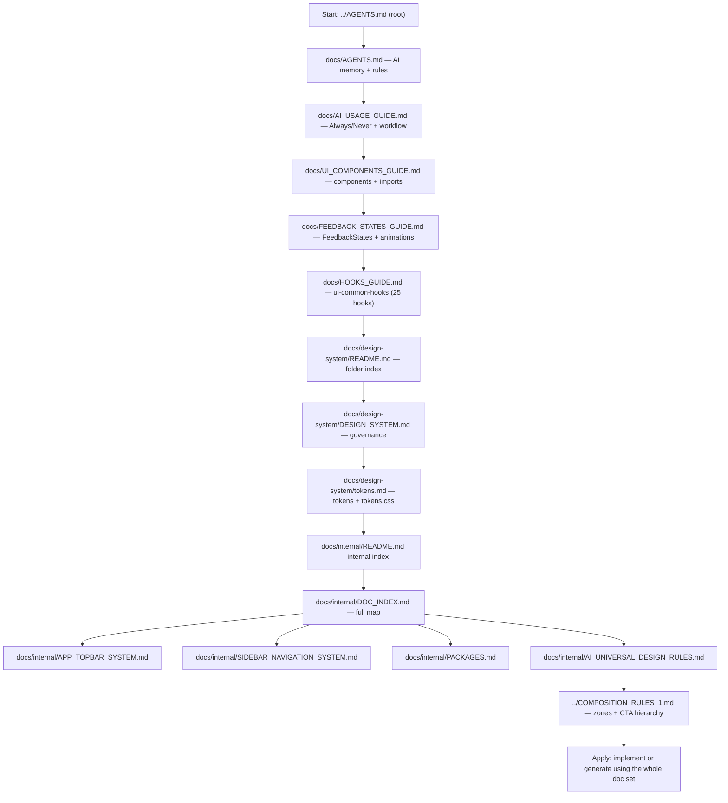

# Documentation

**Developers and AI agents must read every Markdown file under `docs/`** (including `docs/internal/` and `docs/design-system/`). No subsection is optional: public guides and internal notes work together as one system.

> **AI agents:** start at [`../AGENTS.md`](../AGENTS.md) (repo root) — it is the universal entry point.

Latest shared package bundle: `ui-common-components-0.0.2.tgz`  
Hooks package: `ui-common-hooks` v0.3.0

---

## Documentation flow (start: AI agent or developer)

```mermaid
flowchart TD
  Start["Start: ../AGENTS.md (root)"] --> Agents["docs/AGENTS.md — AI memory + rules"]
  Agents --> AIUse["docs/AI_USAGE_GUIDE.md — Always/Never + workflow"]
  AIUse --> UI["docs/UI_COMPONENTS_GUIDE.md — components + imports"]
  UI --> FB["docs/FEEDBACK_STATES_GUIDE.md — FeedbackStates + animations"]
  FB --> HK["docs/HOOKS_GUIDE.md — ui-common-hooks (25 hooks)"]
  HK --> DSRead["docs/design-system/README.md — folder index"]
  DSRead --> DS["docs/design-system/DESIGN_SYSTEM.md — governance"]
  DS --> TK["docs/design-system/tokens.md — tokens + tokens.css"]
  TK --> IntRead["docs/internal/README.md — internal index"]
  IntRead --> Idx["docs/internal/DOC_INDEX.md — full map"]
  Idx --> Top["docs/internal/APP_TOPBAR_SYSTEM.md"]
  Idx --> Side["docs/internal/SIDEBAR_NAVIGATION_SYSTEM.md"]
  Idx --> Pkg["docs/internal/PACKAGES.md"]
  Idx --> Univ["docs/internal/AI_UNIVERSAL_DESIGN_RULES.md"]
  Univ --> Comp["../COMPOSITION_RULES_1.md — zones + CTA hierarchy"]
  Comp --> Done["Apply: implement or generate using the whole doc set"]
```

---

## Read in this order

1. [`../AGENTS.md`](../AGENTS.md) — **root entry point** for AI agents
2. [`README.md`](./README.md) — this file: scope, flow, inventory
3. [`AGENTS.md`](./AGENTS.md) — project AI memory + export name reference
4. [`AI_USAGE_GUIDE.md`](./AI_USAGE_GUIDE.md) — required rules and AI workflow
5. [`UI_COMPONENTS_GUIDE.md`](./UI_COMPONENTS_GUIDE.md) — component choice and APIs
6. [`FEEDBACK_STATES_GUIDE.md`](./FEEDBACK_STATES_GUIDE.md) — FeedbackStates components + animated illustrations
7. [`HOOKS_GUIDE.md`](./HOOKS_GUIDE.md) — `ui-common-hooks` — all 25 hooks
8. [`design-system/README.md`](./design-system/README.md) — design-system folder index
9. [`design-system/DESIGN_SYSTEM.md`](./design-system/DESIGN_SYSTEM.md) — design governance
10. [`design-system/tokens.md`](./design-system/tokens.md) — token import and reference
11. [`internal/README.md`](./internal/README.md) — internal folder index
12. [`internal/DOC_INDEX.md`](./internal/DOC_INDEX.md) — internal map
13. [`internal/APP_TOPBAR_SYSTEM.md`](./internal/APP_TOPBAR_SYSTEM.md) — `AppTopbar` notes
14. [`internal/SIDEBAR_NAVIGATION_SYSTEM.md`](./internal/SIDEBAR_NAVIGATION_SYSTEM.md) — `AppSidebar` notes
15. [`internal/PACKAGES.md`](./internal/PACKAGES.md) — dependency rationale
16. [`internal/AI_UNIVERSAL_DESIGN_RULES.md`](./internal/AI_UNIVERSAL_DESIGN_RULES.md) — portable AI rules
17. [`../COMPOSITION_RULES_1.md`](../COMPOSITION_RULES_1.md) — zones, CTA hierarchy, density

---

## Doc inventory

| Location | Files |
|----------|--------|
| `./` (root) | `AGENTS.md`, `README.md`, `COMPOSITION_RULES_1.md` |
| `docs/` | `README.md`, `AGENTS.md`, `AI_USAGE_GUIDE.md`, `UI_COMPONENTS_GUIDE.md`, `FEEDBACK_STATES_GUIDE.md`, `HOOKS_GUIDE.md` |
| `docs/design-system/` | `README.md`, `DESIGN_SYSTEM.md`, `tokens.md`, `UX-Governance-Design-System.md` |
| `docs/internal/` | `README.md`, `DOC_INDEX.md`, `APP_TOPBAR_SYSTEM.md`, `SIDEBAR_NAVIGATION_SYSTEM.md`, `PACKAGES.md`, `AI_UNIVERSAL_DESIGN_RULES.md` |
| `packages/ui-common-hooks/` | `README.md` |

---

## Public-facing summaries

| File | Use |
|------|-----|
| [`UI_COMPONENTS_GUIDE.md`](./UI_COMPONENTS_GUIDE.md) | What to import, when to use each component, key props |
| [`FEEDBACK_STATES_GUIDE.md`](./FEEDBACK_STATES_GUIDE.md) | EmptyState, ErrorState, OfflineBanner, FeedbackState, animated illustrations, zone mapping |
| [`HOOKS_GUIDE.md`](./HOOKS_GUIDE.md) | All 25 hooks with examples and when to use each |
| [`design-system/DESIGN_SYSTEM.md`](./design-system/DESIGN_SYSTEM.md) | Designer source of truth: layout, spacing, cards, modals, accessibility |
| [`design-system/tokens.md`](./design-system/tokens.md) | Token import path, theme hooks, token do/don't |
| [`AI_USAGE_GUIDE.md`](./AI_USAGE_GUIDE.md) | How AI should read the docs and generate applications correctly |

---

## Internal docs (required reading)

Implementation and maintainer notes live under [`internal/`](./internal/). Read them in the numbered order above so shell systems, packages, and portable AI rules align with the public guides.
