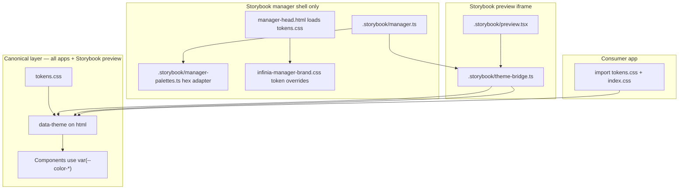

# Theme system — enable syntax, contrast, QA

> **Last verified against library:** 2026-07-02 · `ui-common-components` v0.0.2  
> **Runtime:** `src/design-system/tokens.css` · **Governance:** [`DESIGN_SYSTEM.md`](./DESIGN_SYSTEM.md) §42 · **Import:** [`tokens.md`](./tokens.md)

---

## Enable syntax

Set **one** theme on the document root. Do not combine conflicting values on the same element.

```html
<!-- Classic blue (light) — default: omit attribute or -->
<html data-theme="blue">

<!-- Other named themes -->
<html data-theme="green">
<html data-theme="dark">
<html data-theme="mist">
<html data-theme="custom">
<html data-theme="blue-mist">
<html data-theme="green-mist">
```

Equivalent class hooks (optional): `.theme-blue`, `.theme-green`, `.theme-mist`, `.theme-custom`, `.theme-blue-mist`, `.theme-green-mist`, `.dark`.

**React / Storybook preview:**

```tsx
// App root
document.documentElement.setAttribute("data-theme", "dark");
// Remove attribute for classic light default
document.documentElement.removeAttribute("data-theme");
```

**Toolbar labels in Storybook:** `light` (no attribute), `blue`, `dark`, `green`, `mist`, `custom`, `blue-mist`, `green-mist` — see `.storybook/preview.tsx` globalTypes.

---

## What changes per theme

| Token group | Changes? | Notes |
|-------------|----------|-------|
| `--color-theme-*` (6 slots) | **Yes** | Interaction layer: outlines, links, switch ON, some primary fills |
| `--color-bg-page`, `--color-bg-surface`, `--color-bg-sidebar` | **Mist variants only** | `mist`, `blue-mist`, `green-mist` lighten page/sidebar |
| `--color-text-primary`, `--color-text-secondary` | **Dark only** | Light themes share classic text stack |
| `--color-border-default`, structural borders | **Dark only** | Light themes use `#999` default border |
| `--color-border-focus`, `--color-focus-ring` | **Per theme** | See contrast table below |
| `--button-primary-*` | **Theme-dependent** | Classic blue: Noir fill (§10); `green`/`blue-mist`/`green-mist`/`dark`: theme primary |
| `--app-shell-*`, `--app-sidebar-*` | **Dark + mist** | Shell chrome tracks document theme automatically |
| Spacing, radii, shadows, typography | **No** | Locked across themes |
| Accent families (lavender, sky, mint, …) | **Dark remaps** | `-10` fills adjusted for dark surfaces |
| **Feedback semantics** (`--color-*-fill`, `--color-fill-muted`) | **Dark + mist** | Dark uses `color-mix` fills on `--color-bg-surface`; mist family uses `--color-mist-80` panel wash |

Full §42 rules: [`DESIGN_SYSTEM.md`](./DESIGN_SYSTEM.md) §42.

---

## Feedback semantic tokens (by theme)

Used by `EmptyState`, `ErrorState`, `OfflineBanner`, and SVG illustrations. Defined in `tokens.css` — never hard-code slate/rose hex in component CSS.

| Token | Light (default / blue) | `data-theme="dark"` | `mist` / `blue-mist` / `green-mist` |
|-------|------------------------|---------------------|--------------------------------------|
| `--color-fill-muted` | `--color-mist-40` | `--color-surface-mist` (`#374151`) | `--color-mist-80` |
| `--color-fill-surface` | `--color-bg-surface` | `--color-bg-surface` | `--color-bg-surface` |
| `--color-danger-strong` | `--color-state-error` | `--color-state-error` | same as light |
| `--color-danger-fill` | `--color-accent-rose-10` | `color-mix(error 20%, surface)` | same as light |
| `--color-success-strong` | `--color-accent-mint-fg` | `--color-state-success` | same as light |
| `--color-success-fill` | `--color-accent-mint-10` | `color-mix(success 18%, surface)` | same as light |
| `--color-info-strong` | `--color-accent-sky-fg` | `--color-state-info` | same as light |
| `--color-info-fill` | `--color-accent-sky-10` | `color-mix(info 18%, surface)` | same as light |
| `--color-warning-strong` | `--color-accent-amber-fg` | `--color-state-warning` | same as light |
| `--color-warning-fill` | `--color-accent-amber-10` | `color-mix(warning 18%, surface)` | same as light |
| `--color-warning-soft` | translucent amber wash | `color-mix(warning 14%, page)` | same as light |

**Dark mode QA:** Toggle Theme → **dark** on `Design System / Molecules / Feedback states` stories. Panels should read as tinted slate surfaces — not light rose/mint pastels. Strong/icon colours use `--color-state-*` for contrast on `#1F2937`.

Reference: [`tokens.md`](./tokens.md) · [`FEEDBACK_STATES_GUIDE.md`](../FEEDBACK_STATES_GUIDE.md).

---

## Contrast reference (design-time)

Ratios are **target** WCAG 2.2 AA checks for common pairs. Verify in Storybook with the Theme toolbar when changing tokens.

| Theme | Text on page | Text on surface | Focus ring on page | Focus ring on surface |
|-------|----------------|-----------------|--------------------|-----------------------|
| **light / blue** (default) | `#0D0D0D` on `#E0E0E0` — **≥ AA** | `#0D0D0D` on `#FFFFFF` — **≥ AA** | `#0066CC` on `#E0E0E0` — **≥ 3:1** | `#0066CC` on `#FFFFFF` — **≥ 3:1** |
| **green** | `#0D0D0D` on `#E0E0E0` — **≥ AA** | `#0D0D0D` on `#FFFFFF` — **≥ AA** | `#0D0D0D` on mint hover `#F0FDF4` — **≥ 3:1** | Same |
| **dark** | `#F3F4F6` on `#111827` — **≥ AA** | `#F3F4F6` on `#1F2937` — **≥ AA** | `#0066CC` on `#111827` — **≥ 3:1** | `#0066CC` on `#1F2937` — **≥ 3:1** |
| **mist** | Same text tokens; page `#EDEDED` | Surface `#FAFAFA` | Same as light (`#0066CC`) | Same |
| **custom** (rose) | Same text tokens | Same surfaces | Inherits light focus unless overridden | Do not set low-contrast focus |
| **blue-mist** | Page `#EDEDED` | Surface `#FAFAFA` | `#7C3AED` on page — verify **≥ 3:1** | On `#FAFAFA` — verify |
| **green-mist** | Page `#EDEDED` | Surface `#FAFAFA` | `#0D0D0D` focus (green interaction) | Same |

**Secondary text:** `--color-text-secondary` (`#757575` light / `#9CA3AF` dark) must stay ≥ 4.5:1 on `--color-bg-surface` for body-sized captions.

**Primary button text:** `--color-text-on-primary` / `--color-theme-text` on `--button-primary-default-bg` — required **≥ 4.5:1**.

---

## Component verification matrix

Status as of **2026-07-02** (manual Storybook Theme toolbar pass on representative stories):

| Component / area | light | blue | dark | green | mist | custom | blue-mist | green-mist |
|------------------|:-----:|:----:|:----:|:-----:|:----:|:------:|:---------:|:----------:|
| `Button` (all variants) | ✓ | ✓ | ✓ | ✓ | ✓ | ✓ | ✓ | ✓ |
| `Input` / `Select` / `DatePicker` | ✓ | ✓ | ✓ | ✓ | ✓ | ○ | ○ | ○ |
| `AppTopbar` / `AppSidebar` | ✓ | ✓ | ✓ | ✓ | ✓ | ○ | ✓ | ✓ |
| `DashboardShell` | ✓ | ✓ | ✓ | ✓ | ✓ | ○ | ✓ | ✓ |
| `Modal` / `AlertDialog` | ✓ | ✓ | ✓ | ✓ | ✓ | ○ | ○ | ○ |
| `Table` (sortable, hover) | ✓ | ✓ | ✓ | ✓ | ✓ | ○ | ○ | ○ |
| FeedbackStates (`EmptyState`, `ErrorState`, `OfflineBanner`) | ✓ | ✓ | ✓ (dark fills v0.0.2+) | ✓ | ✓ | ○ | ○ | ○ |
| Charts (`LineChart`, `BarChart`) | ✓ | ✓ | ✓ | ○ | ○ | ○ | ○ | ○ |
| `Card` compound | ✓ | ✓ | ✓ | ✓ | ✓ | ○ | ○ | ○ |

**Legend:** ✓ = verified in Storybook · ○ = inherits tokens; spot-check before release · blank = not yet verified

Update this table when adding components or theme blocks. Use [`COMPONENT_AUDIT.md`](./COMPONENT_AUDIT.md) for per-PR checks.

---

## QA checklist (per theme)

Run after changing `tokens.css` or shell chrome:

1. **Sidebar** — nav icons, active row, hover, focus ring (`AppSidebar` story)
2. **Topbar** — title, search shell, profile menu, primary CTA contrast (`AppTopbar` story)
3. **Inputs** — default, focus, error, disabled on page + surface backgrounds
4. **Feedback** — `EmptyState`, `ErrorState`, `OfflineBanner` tones on page background; **dark:** panel fills must not look like light pastels
5. **Feedback motion** — with OS “Reduce motion” on, SVG illustrations are static (§18)
6. **Charts** — axis labels, grid lines, tooltip on dark
7. **Modals** — overlay, header/footer borders (`--color-border-subtle`), button hierarchy

**Storybook:** Use the **Theme** toolbar global on any story. Real-world feedback layout: `Design System/Molecules/Feedback states/Real-world usage`.

---

## Theming architecture (apps vs Storybook)

Governance theming is **one system** with **one source of truth**: `src/design-system/tokens.css` + `data-theme` on `<html>`. Consumer apps and Storybook **preview** use it directly. Storybook **manager** (sidebar) adds a small, documented adapter because of a Storybook platform limitation — not because the design system uses hex in application code.



| Surface | Theming mechanism | Uses CSS `var(--token)`? | Notes |
|---------|-------------------|--------------------------|-------|
| **Consumer app** | `tokens.css` + `data-theme` | **Yes** | Only integration path — see [`tokens.md`](./tokens.md) |
| **Storybook preview** (canvas / docs) | Same as app via `theme-bridge.ts` | **Yes** | Toolbar Theme global → `data-theme` on iframe `<html>` |
| **Storybook manager** (sidebar / search) | `data-theme` + `tokens.css` + hex adapter | **Mostly yes** | Hex snapshot in `manager-palettes.ts` only where Storybook's JS theme API requires parseable colours |

### Why Storybook manager needs a hex adapter

Storybook's `@storybook/theming/create()` runs every colour through **`polished`** (`opacify`, `darken`, …). Polished **cannot parse** CSS variables (`var(--color-bg-page)`) — it throws [error #5](https://github.com/styled-components/polished/blob/main/src/internalHelpers/errors.md#5) and the manager tab goes white.

**This does not affect shipped components or consumer apps.** Components never call `polished` or Storybook's theme API — they only read CSS custom properties from `tokens.css`.

### What to maintain when tokens change

1. **Always update** `src/design-system/tokens.css` (source of truth).
2. **Update** `.storybook/manager-palettes.ts` hex snapshots for the same theme blocks (manager shell only).
3. **Verify** in Storybook Theme toolbar: preview stories + manager sidebar should match.
4. **Never** add hex theme objects to consumer apps — apps only set `data-theme`.

### Shared bridge files

| File | Role |
|------|------|
| `.storybook/theme-bridge.ts` | Toolbar → `data-theme`; shared by preview + manager |
| `.storybook/manager-palettes.ts` | Hex adapter for Storybook `create()` — mirrors token blocks |
| `.storybook/manager.ts` | Applies bridge + adapter on `GLOBALS_UPDATED` |
| `.storybook/preview.tsx` | Preview decorator — imports bridge only (no hex) |
| `.storybook/manager-head.html` | Loads `tokens.css` + `infinia-manager-brand.css` on manager `<html>` |
| `.storybook/brand/infinia-manager-brand.css` | Token-driven manager overrides (search, focus, accents) |

### Consumer app setup (full design system theming)

```tsx
// main.tsx / layout.tsx — once at app root
import "ui-common-components/design-system/tokens.css";
import "ui-common-components/index.css";

// Optional theme (same values as Storybook toolbar)
document.documentElement.setAttribute("data-theme", "dark");
// Classic light default — omit attribute:
document.documentElement.removeAttribute("data-theme");
```

All components (`Button`, `Table`, `FeedbackState`, `DashboardShell`, …) automatically follow the active theme. **No Storybook-specific code in apps.**

---

## Storybook manager shell theme sync

The **left manager panel** follows the same Theme toolbar as the canvas:

1. `theme-bridge.ts` sets `data-theme` on the manager document `<html>` (same as preview).
2. `tokens.css` (loaded in `manager-head.html`) supplies live `--color-*` values.
3. `infinia-manager-brand.css` applies token overrides to search, focus, and accents.
4. `manager-palettes.ts` supplies hex snapshots to Storybook's JS theme API where required.

**QA:** Switch Theme in the toolbar — canvas **and** sidebar should update page background, text, and accent colours. If preview matches but sidebar accent is wrong, sync `manager-palettes.ts` with the `--color-theme-primary` block in `tokens.css`.

This manager sync is **Storybook-only**. Consumer apps set `data-theme` on their own `<html>` once.

---

## Related docs

| Doc | Content |
|-----|---------|
| [`tokens.md`](./tokens.md) | Import path, feedback token map |
| [`DESIGN_SYSTEM_TOKENS_REFERENCE.md`](./DESIGN_SYSTEM_TOKENS_REFERENCE.md) | Full token tables + CSS snapshot |
| [`DESIGN_SYSTEM.md`](./DESIGN_SYSTEM.md) §42 | Interaction-layer override rules |
| [`COMPONENT_AUDIT.md`](./COMPONENT_AUDIT.md) | Pre-ship checklist |
